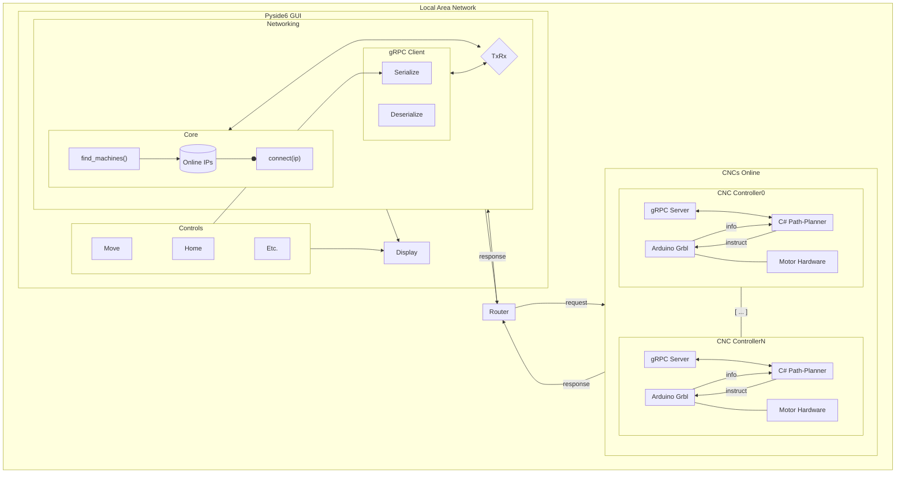

# Distributed CNC Controller System

## WIP: Roadmap of Future Work Ahead

### Motivation

This is a prototype of a system architecture for multiple Computer Numerical Control (CNC) machines.

Features:

- Qt6 GUI (Python 3.12 w/ Pyside6) offers tools for discovering, monitoring, manipulating, or otherwise interacting with CNCs accessible on the local network.
- Containerized Control Suite (Docker)
  - Communication Server (gRPC, Protobuf)
  - Motion Planning (C#)
  - LLC (Arduino)

### System

A Python GUI (Pyside6) features tools for querying the local network for devices with an active gRPC server. Populating a page of the UI with options for viable connections, the user may select one of the IP addresses indicated, and begin interfacing with the system on the device.

> [!NOTE]
> This pseudo-implementation attempts to account for a future feature allowing for remote access (from an external server/over the web), though authentication and credentialing is not discussed; further lock-out mechanisms would be necessary, as manipulating a machine without direct physical access relies on safeguards to prevent physical damage or personal harm.

### Theory of Operation

Google's RPC framework (gRPC) utilizes protobuf files to create a language agnostic communication protocol. Its use here is apt, given the multiple languages across the codebase.

The protobuf files are defined in the root of the project, providing a message syntax common across the codebase. The Python implementation is then able to send/receive messages after attaching to an external controller instance, assuming the controller software was compiled/deployed with compatible syntaxes.

The controller should be able to serve a variety of requests from the GUI and return a response with the relevant information, if any.

Contextual information regarding the Motion Planning software, the Path-Planning algorithm (model slicing, machine parameters, tooling, etc.), and the Microcontroller layer are absent, and hence the code to represent them is left mostly empty. However, the framework here attempts to mimic the system, though relatively featureless.

### In Action

Docker Containers are created and run locally. Each hosts a gRPC server, C# motion/path planning code, and Low-Level Control software for motion control of the "hardware" via Grbl deployed on an Arduino.

Once containers are running, the Python GUI may query the Local Area Network for network devices with predefined ports exposed. A proof-of-life message can be sent across this channel, initiating a communication avenue for the GUI.
